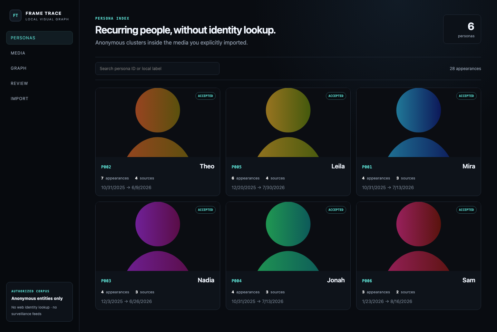
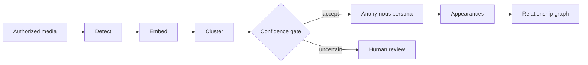

# FRAME TRACE

**Local-first visual relationship explorer for authorized media.** Frame Trace groups recurring face appearances inside a media corpus you explicitly supply, keeps the evidence behind each anonymous persona assignment, and turns those appearances into a navigable source/media/co-occurrence graph.

> It does not identify unknown people, search the public internet by face, scrape social profiles, or connect to surveillance-camera networks.




## What it demonstrates

- OpenCV YuNet detection + SFace representation behind explicit interfaces;
- exact cosine retrieval without unnecessary vector infrastructure;
- DBSCAN clustering with deliberate abstention on weak assignments;
- append-only human review decisions instead of silent model overrides;
- source → asset → frame → detection → persona provenance;
- image/video ingest contracts with SHA-256 duplicate detection;
- a relational graph projection rather than a separate graph database;
- FastAPI + WebSocket progress and a polished React/React Flow client;
- deterministic offline demo data plus a separate real-CV adapter path.



## Quickstart

```bash
python3.12 -m venv .venv
source .venv/bin/activate
pip install -e '.[dev]'

frame-trace demo
frame-trace serve
```

In another terminal:

```bash
cd frontend
npm install
npm run dev
```

Open `http://127.0.0.1:5173`.

The default demo is completely offline and requires no API key or model download.

## Real CV models

To enable the YuNet + SFace adapters:

```bash
python scripts/fetch_models.py
frame-trace doctor
```

The downloader verifies SHA-256 values published by the OpenCV Zoo Git LFS pointers before accepting model files. Model licenses and sources are recorded in [`models/manifest.json`](models/manifest.json) and [`docs/DEPENDENCIES.md`](docs/DEPENDENCIES.md).

## Product tour

**Personas** — anonymous recurring clusters with appearance/source counts and date span.

**Persona detail** — timeline, source distribution, media grid, and observed co-occurrence counts.

**Graph** — progressively explores persona → media → source plus persona ↔ persona co-occurrence edges.

**Review** — uncertain assignments are explicitly accepted, rejected, or left unknown; decisions are stored separately from machine proposals.

**Import** — shows the bounded local processing stages: discover → hash → decode → sample → detect → embed → cluster → project.

## Why the system abstains

Wrongly merging two different people contaminates every downstream appearance and graph edge. Frame Trace therefore prefers:

```text
UNASSIGNED > WRONG PERSONA
```

DBSCAN may emit noise, and a second medoid-consistency gate can downgrade a weak membership to `review_required`. Similarity values are heuristics, not probabilities of real identity.

## Data model

```text
Source
  └─ Asset
      └─ Frame
          └─ FaceDetection
              ├─ FaceEmbedding
              └─ PersonaMembership

Persona
  ├─ Appearance
  └─ Review history
```

Every graph claim remains traceable to imported media.

## Commands

```bash
frame-trace doctor
frame-trace demo
frame-trace serve
frame-trace import ./my-authorized-media
frame-trace recluster
frame-trace evaluate
frame-trace reset
```

## Evaluation

The deterministic fixture includes ground-truth cluster labels so the reference engine can report pairwise precision/recall/F1, Adjusted Rand Index, abstention rate, false-merge pairs, and false-split pairs.

Run:

```bash
frame-trace evaluate
```

The deterministic fixture validates clustering and graph logic. It is deliberately not described as SFace output. Real CV evaluation requires checksum-verified model weights and user-authorized media.

## Verification

Verified locally on Apple Silicon macOS with both the deterministic system path and the real YuNet/SFace path:

```text
Backend tests         14 passed
Frontend typecheck    PASS
Vitest                1 passed
Vite production build PASS
Playwright E2E        1 passed

Real YuNet detection  PASS
Real SFace embedding  PASS
Real media import     PASS
False-merge pairs     0
```

The real CV smoke produced two detections, two 128-dimensional normalized SFace embeddings, one anonymous persona cluster, and two persisted appearances. The local test image and downloaded model weights are not included in the repository.

See [`docs/VERIFICATION.md`](docs/VERIFICATION.md) for the full verification record.

Run the reproducible deterministic release sweep with:

```bash
./scripts/verify_release.sh
```

## Repository map

```text
backend/frame_trace/
  api/          FastAPI + WebSocket surface
  cv/           YuNet/SFace adapters and video frame processing
  clustering/   exact cosine, DBSCAN, evaluation
  ingest/       folder + manifest package boundaries
  graph/        relational graph projection
  persistence/  SQLite schema and access boundary
  services/     application behavior

frontend/src/
  features/     personas, media, graph, review, import

demo/           deterministic safe fixture
models/         checksummed model manifest
scripts/        bootstrap, model fetch, release verification
```

## Scope

Frame Trace is a local proof-of-work visual organization system. It does not claim real-world identity, relationship, location, affiliation, or production recognition accuracy. Co-occurrence means only that two anonymous clusters were observed in the same supplied media.

See [`SECURITY.md`](SECURITY.md) and [`docs/PRIVACY.md`](docs/PRIVACY.md) before adapting the project to other datasets.
