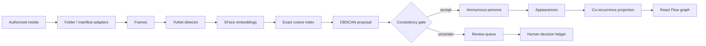

# Architecture

Frame Trace is a single-node local application. The frontend is a React/Vite client; FastAPI exposes the local API; SQLite stores provenance, assignments, review decisions, and the graph projection inputs.

## Provenance

Every derived persona assignment can be traced backward through `membership -> detection -> frame -> asset -> source`. Manual review decisions are appended separately rather than overwriting the machine proposal history.

## Why SQLite

The showcase workload is local and bounded. SQLite keeps installation simple, supports foreign keys and indexes, and avoids introducing a service solely for storing a few hundred or few thousand vectors and graph rows.

## Why the graph is a projection

The graph represents observed media relationships, not a separate source of truth. Nodes and edges are assembled from relational evidence. A dedicated graph database is unnecessary for the intended scale and would make the demo harder to inspect.
